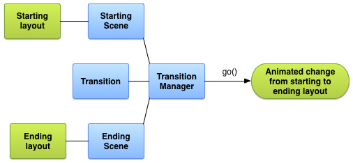
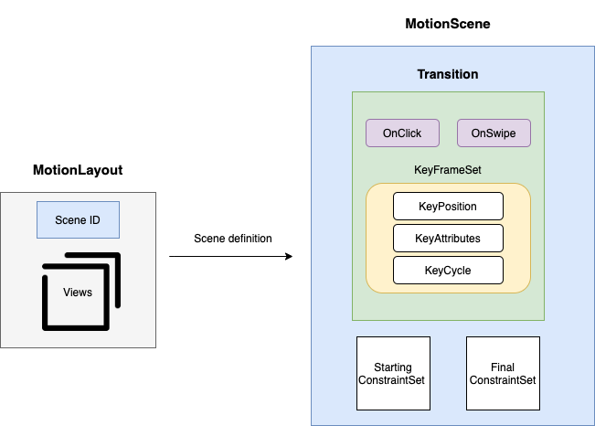

# This repository showcases various Android animation libraries.

### 1. Loading Button
Android button that uses morph animation to transform into circular progressbar. Easy way to make your application more responsive.
You can find library repository [here](https://github.com/leandroBorgesFerreira/LoadingButtonAndroid). Example of usage [here](https://github.com/nomtek/android-animations/blob/master/app/src/main/java/com/nomtek/animations/demo/ProgressButtonFragment.kt).\
\

### 2. TransformationLayout
Transform view into another view using morph animation. You can also morph between two activities or fragments.
This is very nice looking effect that will help your user to better understand changes happening on the screen.
TransformationLayout uses *MaterialContainerTransform* from *com.google.android.material:material* package to achieve the effect.
You can find library repository [here](https://github.com/skydoves/TransformationLayout). Example of usage [here](https://github.com/nomtek/android-animations/blob/master/app/src/main/java/com/nomtek/animations/demo/TransformationFragment.kt).\
\

### 3. Spring animation
You might consider using spring animation if you need physics based motion. You can customize spring's stiffness, damping ratio and its final position to achieve desired effect.
You can find documentation [here](https://developer.android.com/reference/androidx/dynamicanimation/animation/SpringAnimation). Example of usage [here](https://github.com/nomtek/android-animations/blob/master/app/src/main/java/com/nomtek/animations/demo/SpringFragment.kt).\
\

### 4. Fling animation
You can customize fling animation's friction and starting velocity. Friction force will be proportional to object's velocity.
You can find documentation [here](https://developer.android.com/guide/topics/graphics/fling-animation). Example of usage [here](https://github.com/nomtek/android-animations/blob/master/app/src/main/java/com/nomtek/animations/demo/FlingFragment.kt).\
\

### 5. Animate layout changes
`android:animateLayoutChanges` flag is a great and easy way to breathe life into your application. You can use this flag on any *ViewGroup*.
 Android framework will then automatically animate layout changes caused by any of the following actions:
- adding view
- removing view
- changing view visibility
- resizing view
<!-- -->
You might also customize animation by modifying *LayoutTransition* object. Have in mind that this API is quite old and limited so you won't be able to achieve every effect you wish for.
You can find documentation [here](https://developer.android.com/reference/android/animation/LayoutTransition). Example of usage [here](https://github.com/nomtek/android-animations/blob/master/app/src/main/java/com/nomtek/animations/demo/LayoutChangesFragment.kt).\
\

### 6. Transitions API
Transition framework makes it easy to animate various changes in your application’s UI by simply providing the starting layout and the ending layout. You can describe what kind of animations you would like to use (fade in, fade out, translation) and the transition library will figure out how to animate from the starting layout to the ending layout.
You can use transition framework to animate between activities or fragments. You might also animate simple layout changes.
We can animate layout changes simply by calling
```
TransitionManager.beginDelayedTransition(layout)
//apply changes to layout
```
You might want to create custom transitions if required animation isn’t supported by one of the default transitions.
You can do this by providing custom *Transition* object
```
val transition = TransitionSet().apply {
                ordering = TransitionSet.ORDERING_SEQUENTIAL
                addTransition(ChangeColor())
                addTransition(Explode().addTarget(secondImageView))
                addTransition(Fade().addTarget(imageView).setStartDelay(1000))
            }
```
Have in mind that Transitions API has some limitations:
- Animations applied to *SurfaceView* or *TextureView* might not be displayed correctly.
- Classes extending *AdapterView* like *ListView* are incompatible with Transitions framework.
- If you resize widget with text then text will not be animated. It will just pop to the final location.
<!-- -->
You can find documentation [here](https://developer.android.com/training/transitions). Example of usage [here](https://github.com/nomtek/android-animations/blob/master/app/src/main/java/com/nomtek/animations/demo/TransitionLayoutChangesFragment.kt).\
\

### 7. Transitions API - Scenes
To animate between two layouts with Transitions framework you would use scenes API.\
Steps needed to create animation:
1. Create two *Scene* objects - one for the starting layout and second one for ending layout.
2. Create *Transition* object. You customize animations and order.
3. Invoke *TransitionManager.go()*.
<!-- -->
\

\
\
You can find documentation [here](https://developer.android.com/reference/android/transition/Scene). Example of usage [here](https://github.com/nomtek/android-animations/blob/master/app/src/main/java/com/nomtek/animations/demo/SceneFragment.kt).\
\

### 8. ConstraintSet
*ConstraintSet* lets you manipulate set of constraints of *ConstraintLayout*. You can combine manipulating constraint set with Transition API to achieve complex animations easily!
You can find documentation [here](https://developer.android.com/reference/androidx/constraintlayout/widget/ConstraintSet). Example of usage [here](https://github.com/nomtek/android-animations/blob/master/app/src/main/java/com/nomtek/animations/demo/ConstraintSetFragment.kt).\
\

### 9. Activity transition
You can use Transitions API for activity transitions as well. You can provide enter and exit transitions. You can also specify transition for shared elements between two activities.
```
val options = ActivityOptions.makeSceneTransitionAnimation(this, androidRobotView, "robot")
startActivity(intent, options.toBundle())
```
Thanks to this, shared elements from one activity will seamlessly transition to second activity.
You can find documentation [here](https://developer.android.com/training/transitions/start-activity). Example of usage [here](https://github.com/nomtek/android-animations/blob/master/app/src/main/java/com/nomtek/animations/demo/ActivityTransitionFragment.kt).\
\

### 10. MotionLayout - basics
MotionLayout is a powerful layout that will let you create complex animations without single line of code. It's fully declarative - you define transitions and interactions in xml.
It's a subclass of *ConstraintLayout*. It uses underneath property animation framework and Transitions API.
\

\
\
You can find documentation [here](https://developer.android.com/training/constraint-layout/motionlayout). Example of usage [here](https://github.com/nomtek/android-animations/blob/master/app/src/main/java/com/nomtek/animations/demo/MotionLayoutFragment.kt).\
\

\
\
You can see above debugging overlay. It will show you paths of widgets and will show animation frame rate.
You can enable it with `app:motionDebug="SHOW_ALL"`.
### 11. MotionLayout - key frame set
We can control how animation progresses thanks to *KeyFrameSet*.
MotionLayout support various keyframes:
1. KeyPosition - specifies a view’s position during the motion sequence.
2. KeyAttribute - specifies a view’s attribute value during the motion sequence.
3. KeyCycle - adds oscillation to the animation. You can specify *waveShape*, *waveOffset* and *wavePeriod*.
4. KeyTimeCycle - a keyframe that allows you to define a cycle driven by time instead of animation progress.
<!-- -->
Common keyframes attributes:
- *framePosition* defines number of the frame (from 0 to 100).
- *target* defines which view should be modified.
<!-- -->
\
It might be a little bit difficult to design complex animation with keyframes. Luckily you can use [cycle editor](https://github.com/googlesamples/android-ConstraintLayoutExamples/releases/download/1.0/CycleEditor.jar)
for that. It's a tool designed by Google developers that will let you to adjust key cycles in GUI environment.
You can find documentation [here](https://developer.android.com/reference/androidx/constraintlayout/motion/widget/MotionLayout). Example of usage [here](https://github.com/nomtek/android-animations/blob/master/app/src/main/java/com/nomtek/animations/demo/OtherMotionLayoutFragment.kt).\
\

### 12. Side panel
Demonstration of what can be achieved with *MotionLayout* in few lines of code.
Example of usage [here](https://github.com/nomtek/android-animations/blob/master/app/src/main/java/com/nomtek/animations/demo/SidePanelFragment.kt).\
\

### 13. Vector drawable
Sometimes it's very useful to animate icons. For example you may need to create progress bar animation consisting of several images or maybe you would like to create animation where one icon morphs into another. I have good news for you. You can delegate creating animation to your designer! This [tool](https://shapeshifter.design/) will generate drawable xml.
You can find documentation [here](https://developer.android.com/guide/topics/graphics/vector-drawable-resources). Example of usage [here](https://github.com/nomtek/android-animations/blob/master/app/src/main/java/com/nomtek/animations/demo/VectorDrawableFragment.kt).\
\

### 14. CoordinatorLayout
This layout can be used for many things but most often you will use it in combination with [AppBarLayout](https://developer.android.com/reference/com/google/android/material/appbar/AppBarLayout) to achieve complex toolbar animations.
You may also create your own custom behaviours that will dictate how *CoordinatorLayout* children interact with each other.
You might take a look at [ShrinkBehaviour](https://github.com/nomtek/android-animations/blob/master/app/src/main/java/com/nomtek/animations/demo/behaviour/ShrinkBehaviour.kt) as a reference. It demonstrates how to create behaviour that will shrink you FAB
when bottom panel slides in. You can also create more complex behaviours - take a look at the [SwipeToDismissBehaviour](https://github.com/nomtek/android-animations/blob/master/app/src/main/java/com/nomtek/animations/demo/behaviour/SwipeToDismissBehaviour.kt).
This example illustrates usage of *ViewDragHelper*, powerful class that makes detecting drag gestures much easier.
You can find *CoordinatorLayout* documentation [here](https://developer.android.com/reference/androidx/coordinatorlayout/widget/CoordinatorLayout). Example of usage [here](https://github.com/nomtek/android-animations/blob/master/app/src/main/java/com/nomtek/animations/demo/CoordinatorLayoutFragment.kt).\
\

### 15. Coordinator layout with BottomSheetBehavior
Another popular use case with *CoordinatorLayout* is bottom sheet. Bottom sheet is a view that may be dragged by user to reveal its content.
Yow will achieve this effect by applying *BottomSheetBehavior* to a *ViewGroup* nested in *CoordinatorLayout*.
You can find documentation [here](https://developer.android.com/reference/com/google/android/material/bottomsheet/BottomSheetBehavior). Example of usage [here](https://github.com/nomtek/android-animations/blob/master/app/src/main/java/com/nomtek/animations/demo/BottomSheetFragment.kt).\
\
