# This repository showcases various Android animation libraries.

### 1. Loading Button
Android button that uses morph animation to transform into circular progressbar. Easy way to make your application more responsive.
You can find library repository [here](https://github.com/leandroBorgesFerreira/LoadingButtonAndroid). Example of usage [here](https://github.com/nomtek/android-animations/blob/master/app/src/main/java/com/nomtek/animations/demo/ProgressButtonFragment.kt).\
\
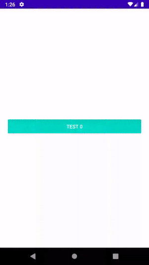
### 2. TransformationLayout
Transform view into another view using morph animation. You can also morph between two activities or fragments.
This is very nice looking effect that helps your user to better understand changes happening on the screen.
TransformationLayout uses MaterialContainerTransform from com.google.android.material:material to achieve the effect.
You can find library repository [here](https://github.com/skydoves/TransformationLayout). Example of usage [here](https://github.com/nomtek/android-animations/blob/master/app/src/main/java/com/nomtek/animations/demo/TransformationFragment.kt).\
\

### 3. Spring animation
Use this if you need physics based animation. You can customize spring's stiffness, damping ratio and its final position to achieve real like motion.
You can find documentation [here](https://developer.android.com/reference/androidx/dynamicanimation/animation/SpringAnimation). Example of usage [here](https://github.com/nomtek/android-animations/blob/master/app/src/main/java/com/nomtek/animations/demo/SpringFragment.kt).\
\
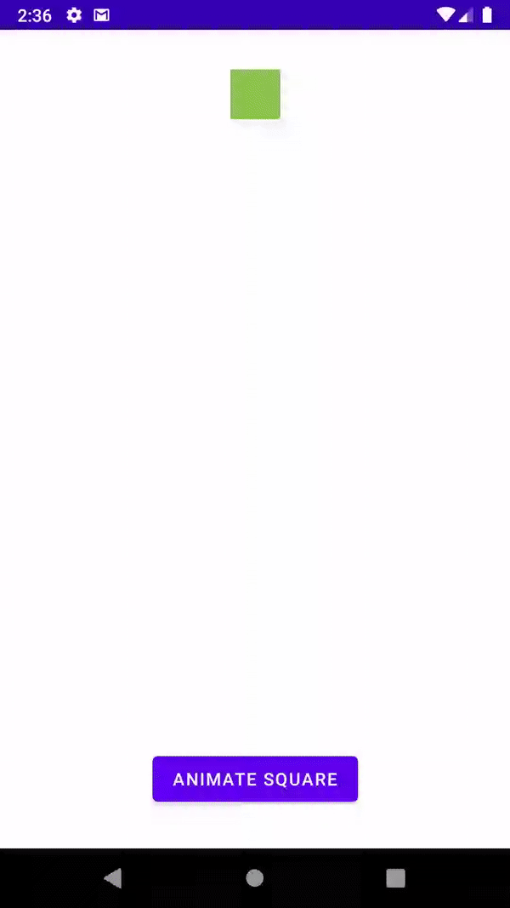
### 4. Fling animation
In fling animation you can customize friction and starting velocity. Friction force will be proportional to object's velocity.
You can find documentation [here](https://developer.android.com/guide/topics/graphics/fling-animation). Example of usage [here](https://github.com/nomtek/android-animations/blob/master/app/src/main/java/com/nomtek/animations/demo/FlingFragment.kt).\
\
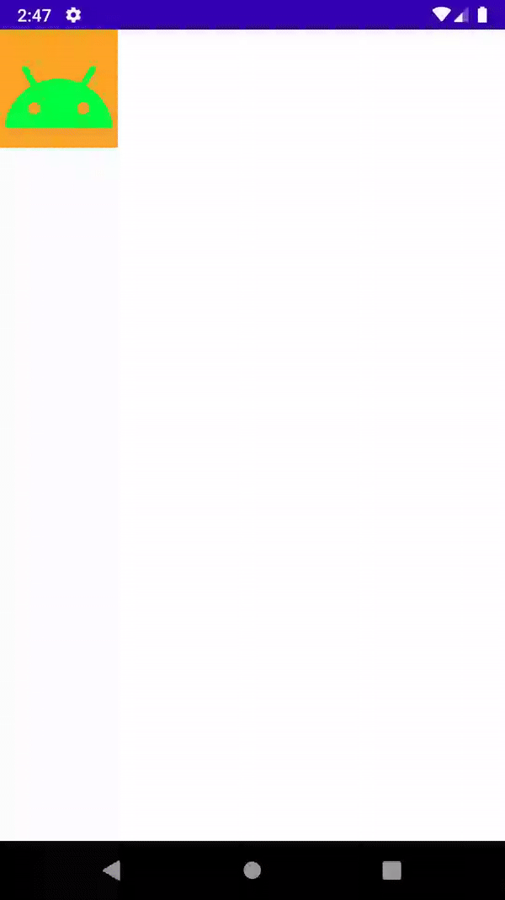
### 5. Animate layout changes
`android:animateLayoutChanges` flag is a great and easy way to breathe life into your application. We can use this flag on any ViewGroup.
 Android framework will then automatically animate layout changes caused by any of the following actions:
- adding view
- removing view
- changing view visibility
- resizing view
<!-- -->
We can also customize animation by modifying LayoutTransition object. Have in mind that this API is quite old and limited so you won't be able to achieve every effect you wish for.
You can find documentation [here](https://developer.android.com/reference/android/animation/LayoutTransition). Example of usage [here](https://github.com/nomtek/android-animations/blob/master/app/src/main/java/com/nomtek/animations/demo/LayoutChangesFragment.kt).\
\
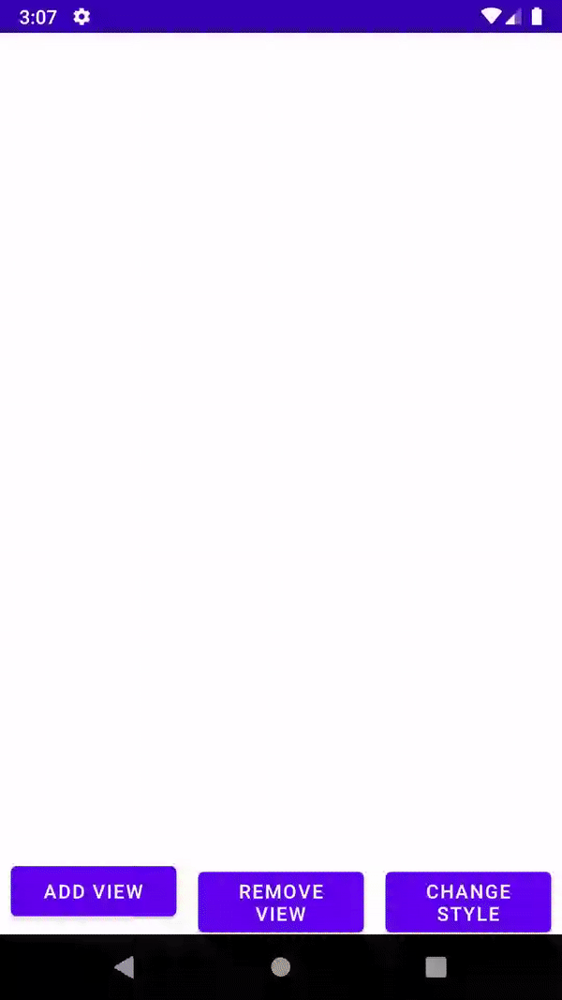
### 6. Transitions API
You can find documentation [here](https://developer.android.com/training/transitions). Example of usage [here](https://github.com/nomtek/android-animations/blob/master/app/src/main/java/com/nomtek/animations/demo/TransitionLayoutChangesFragment.kt).\
\
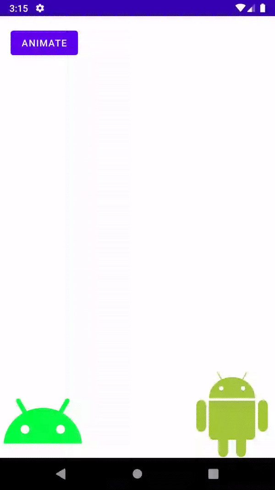
### 7. Scenes API
You can find documentation [here](https://developer.android.com/reference/android/transition/Scene). Example of usage [here](https://github.com/nomtek/android-animations/blob/master/app/src/main/java/com/nomtek/animations/demo/SceneFragment.kt).\
\
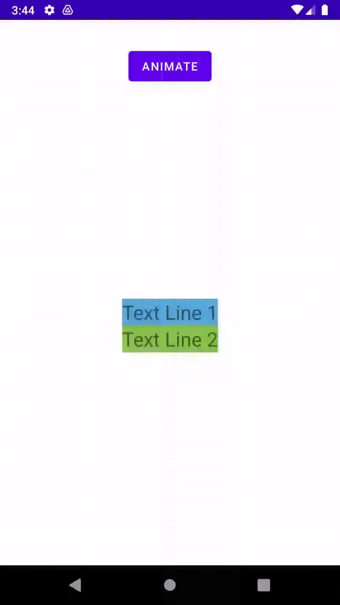
### 8. ConstraintSet
You can find documentation [here](https://developer.android.com/reference/androidx/constraintlayout/widget/ConstraintSet). Example of usage [here](https://github.com/nomtek/android-animations/blob/master/app/src/main/java/com/nomtek/animations/demo/ConstraintSetFragment.kt).\
\
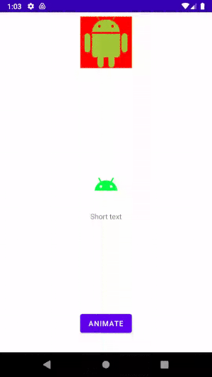
### 9. Activity transition
You can find documentation [here](https://developer.android.com/training/transitions/start-activity). Example of usage [here](https://github.com/nomtek/android-animations/blob/master/app/src/main/java/com/nomtek/animations/demo/ActivityTransitionFragment.kt).\
\

### 10. MotionLayout - basics
You can find documentation [here](https://developer.android.com/training/constraint-layout/motionlayout). Example of usage [here](https://github.com/nomtek/android-animations/blob/master/app/src/main/java/com/nomtek/animations/demo/MotionLayoutFragment.kt).\
\
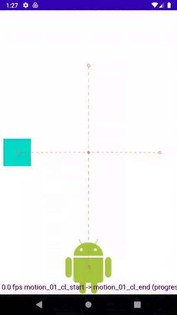
### 11. MotionLayout - key cycles
You can find documentation [here](https://developer.android.com/reference/androidx/constraintlayout/motion/widget/MotionLayout#keycycle). Example of usage [here](https://github.com/nomtek/android-animations/blob/master/app/src/main/java/com/nomtek/animations/demo/OtherMotionLayoutFragment.kt).\
\
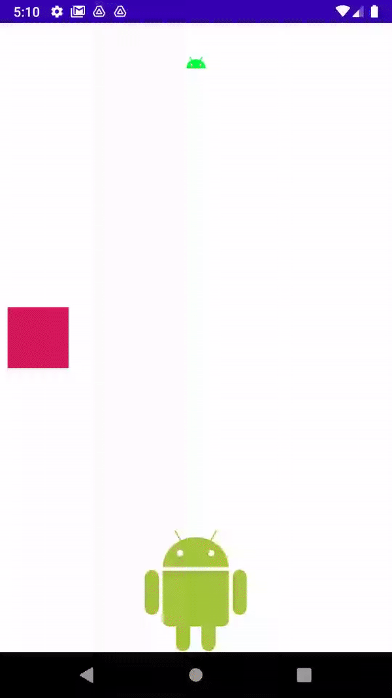
### 12. Side panel
Illustrates motion layout usage in practice Example of usage [here](https://github.com/nomtek/android-animations/blob/master/app/src/main/java/com/nomtek/animations/demo/SidePanelFragment.kt).\
\
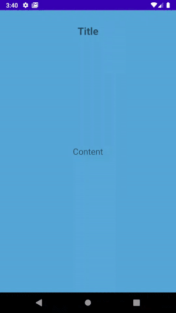
### 13. Vector drawable
You can find documentation [here](https://developer.android.com/guide/topics/graphics/vector-drawable-resources). Example of usage [here](https://github.com/nomtek/android-animations/blob/master/app/src/main/java/com/nomtek/animations/demo/VectorDrawableFragment.kt).\
\
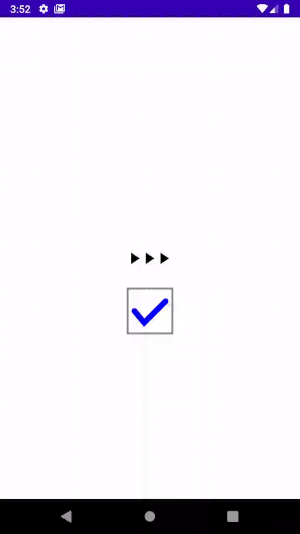
### 14. Coordinator layout
You can find documentation [here](https://developer.android.com/reference/androidx/coordinatorlayout/widget/CoordinatorLayout). Example of usage [here](https://github.com/nomtek/android-animations/blob/master/app/src/main/java/com/nomtek/animations/demo/CoordinatorLayoutFragment.kt).\
\

### 15. Coordinator layout with BottomSheetBehavior
You can find documentation [here](https://developer.android.com/reference/com/google/android/material/bottomsheet/BottomSheetBehavior). Example of usage [here](https://github.com/nomtek/android-animations/blob/master/app/src/main/java/com/nomtek/animations/demo/BottomSheetFragment.kt).\
\
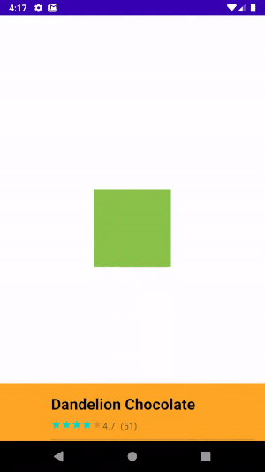